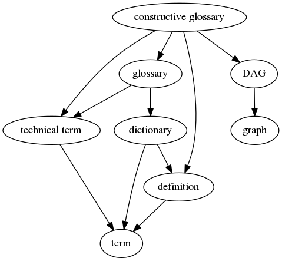

Vanity
==

Introduction
--

What is intuition? What are emotions? These are the type of questions
that are often asked by those in the field of artificial
cognition. Each author has their own model of cognition, but tend to
reuse many common words while giving them narrower meanings. The meaning
of words such as "intuition" or "emotion" require proper definitions.
For ease of communication, these definitions benefit from brevity and
from a clear view of how they relate to each other. This is what this
project proposes to solve.

This project offers three things:

1. Recommendations for defining technical terms, and in particular the
   avoidance of mutually-recursive definitions.
2. A machine-readable, human-readable format for structuring
   glossaries.
3. A command-line program called `vanity` for formatting a glossary
   into an HTML document or a graph of terms.

Example
--

The following glossary was formatted by `vanity` from
[examples/vanity.yml](examples/vanity.yml) and inserted into this readme:

<p class="vanity-def">
  <a name="vanity-7465726d"></a><strong class="vanity-term">term</strong>:
  <span class="vanity-contents">a word or sequence of words whose meaning depends on the context.
</span>
</p>

<p class="vanity-def">
  <a name="vanity-646566696e6974696f6e"></a><strong class="vanity-term">definition</strong>:
  <span class="vanity-contents">a textual description of the meaning or meanings of a <a href="#vanity-7465726d" class="vanity-term-link">term</a>.
</span>
</p>

<p class="vanity-def">
  <a name="vanity-746563686e6963616c207465726d"></a><strong class="vanity-term">technical term</strong>:
  <span class="vanity-contents">a <a href="#vanity-7465726d" class="vanity-term-link">term</a> with a fixed meaning within a field of study. Such <a href="#vanity-7465726d" class="vanity-term-link">terms</a> may be formatted differently than ordinary <a href="#vanity-7465726d" class="vanity-term-link">terms</a> to indicate that they should be interpreted as a <a href="#vanity-746563686e6963616c207465726d" class="vanity-term-link">technical term</a>.
</span>
</p>

<p class="vanity-def">
  <a name="vanity-64696374696f6e617279"></a><strong class="vanity-term">dictionary</strong>:
  <span class="vanity-contents">a set of <a href="#vanity-7465726d" class="vanity-term-link">terms</a> and their <a href="#vanity-646566696e6974696f6e" class="vanity-term-link">definitions</a>.
</span>
</p>

<p class="vanity-def">
  <a name="vanity-676c6f7373617279"></a><strong class="vanity-term">glossary</strong>:
  <span class="vanity-contents">a <a href="#vanity-64696374696f6e617279" class="vanity-term-link">dictionary</a> of <a href="#vanity-746563686e6963616c207465726d" class="vanity-term-link">technical terms</a>.
</span>
</p>

<p class="vanity-def">
  <a name="vanity-6772617068"></a><strong class="vanity-term">graph</strong>:
  <span class="vanity-contents">a graph in the sense of graph theory, that is a set of nodes and a set of edges connecting nodes.
</span>
</p>

<p class="vanity-def">
  <a name="vanity-444147"></a><strong class="vanity-term">DAG</strong>:
  <span class="vanity-contents"><a href="#vanity-444147" class="vanity-term-link">DAG</a> is the usual abbreviation for a directed acyclic <a href="#vanity-6772617068" class="vanity-term-link">graph</a> in graph theory. Each edge is an arrow connecting two nodes. In a <a href="#vanity-444147" class="vanity-term-link">DAG</a>, following the edges starting from any node guarantees that eventually we&#39;ll reach a node that has no outgoing edges.
</span>
</p>

<p class="vanity-def">
  <a name="vanity-636f6e73747275637469766520676c6f7373617279"></a><strong class="vanity-term">constructive glossary</strong>:
  <span class="vanity-contents">a <a href="#vanity-676c6f7373617279" class="vanity-term-link">glossary</a> which forms a <a href="#vanity-444147" class="vanity-term-link">DAG</a> of <a href="#vanity-746563686e6963616c207465726d" class="vanity-term-link">technical terms</a>. For each <a href="#vanity-746563686e6963616c207465726d" class="vanity-term-link">technical term</a>, there is a unique node A. For each reference to a <a href="#vanity-746563686e6963616c207465726d" class="vanity-term-link">technical term</a> B in the <a href="#vanity-646566696e6974696f6e" class="vanity-term-link">definition</a> of A, there is an edge AB in the <a href="#vanity-444147" class="vanity-term-link">DAG</a>.
</span>
</p>

The graph was exported by `vanity` to the dot format, and then `dot`
turned it into this image:



The [source yaml for this glossary](examples/vanity.yml) is:

```yaml
# Glossary of terms used by the vanity project.
---
- term: term
  def: >
    a word or sequence of words whose meaning depends on the context.
  syn:
    - terms
- term: definition
  def: >
    a textual description of the meaning or meanings of a [term].
  syn:
    - definitions
- term: technical term
  def: >
    a [term] with a fixed meaning within a field of study. Such [terms] may be
    formatted differently than ordinary [terms] to indicate that they should
    be interpreted as a [technical term].
  syn:
    - technical terms
- term: dictionary
  def: >
    a set of [terms] and their [definitions].
- term: glossary
  def: >
    a [dictionary] of [technical terms].
  syn:
    - glossaries
- term: graph
  def: >
    a graph in the sense of graph theory, that is a set of nodes and
    a set of edges connecting nodes.
- term: DAG
  def: >
    [DAG] is the usual abbreviation for a directed acyclic [graph] in graph
    theory. Each edge is an arrow connecting two nodes. In a [DAG], following
    the edges starting from any node guarantees that eventually we'll reach
    a node that has no outgoing edges.
- term: constructive glossary
  def: >
    a [glossary] which forms a [DAG] of [technical terms].
    For each [technical term], there is a unique node A. For each
    reference to a [technical term] B in the [definition] of A,
    there is an edge AB in the [DAG].
```

The commands for producing these results can be found in
[examples/Makefile](examples/Makefile).

Implementation
--

`vanity` is implemented as a command-line program that
reads a dictionary in source form, checks its validity, and produces a
readable document.

The input is a list of term definitions. The yaml syntax was chosen as
it accommodates text better than json and is more readable than
XML. Structured data such as lists of synonyms can easily be added
without extending the syntax. The only originality is in the markup
language used in the body of the definitions, which uses its own
conventions to link terms to their definition.

The Go language was chosen for this implementation as it's relatively
friendly to external contributors, and it was a good opportunity for
me author to learn it. The ability to distribute binaries with no
runtime dependencies and for various platforms is also a big plus.

Installation
--

[Download](https://github.com/mjambon/vanity/releases) a
statically-linked executable for your platform.

If your platform is not in there or if you want to try a development
version, you'll have to build it from source. We have some
instructions in [DEV.md](DEV.md). After installing the prerequisites,
you can build and install `vanity` for your Unixy platform using
`make && make install`.

Documentation
--

Once installed, check out the output of `vanity --help`.
The following output formats are supported:

* HTML snippet or standalone page
* graph in the dot format understood by Graphviz

Input format reference
--

A valid input document is a [yaml](https://yaml.org/) document,
consisting of an ordered list (yaml array) of definitions. Each
definition has 2 mandatory fields `term` and `def`, and an optional
field `syn`.

* `term`: string that represents the standard form of the term being
  defined.
* `def`: string that holds the definition for the term. Links to other
  terms are placed within square brackets, such as in
  `The sky is [cloudy] today.`. Only links to previous definitions
  or to the current definition are permitted. The text of the link must
  be a term from a `term` field or one of its synonyms from a `syn`
  field.
* `syn`: array of strings that are considered synonyms with the term
  being defined, in the sense that any reference to a synonym will
  link to the standard term. This can be used to hold different
  variations of a word, such as plural forms, gendered forms, plain
  synonyms, conjugated forms of verbs, etc. (this will become annoying
  for some languages other than English)

The definitions must be sorted such that all links refer to terms that
were defined earlier. For example, the following is valid input:

```yaml
- term: potato
  def: the edible tuber from the potato plant
- term: French fries
  def: deep-fried [potato] chunks
```

We can add `potatoes` as a synonym of `potato` and link to `potatoes`
instead of `potato`:

```yaml
- term: potato
  def: the edible tuber from the potato plant
  syn:
    - potatoes
- term: French fries
  def: deep-fried [potatoes]
```

Order matters. The following is illegal:

```yaml
- term: French fries
  def: deep-fried [potato] chunks
- term: potato
  def: the edible tuber from the potato plant
```

In that case we get an error message:
```sh
$ vanity < glossary.yml > glossary.html
error: definition for term 'French fries' uses undefined term: 'potato'.
```

Ideas for future contributions
--

Public awareness:
* Write an introductory article explaining why and when this thing can
  be useful.
* Use the tool and publish reports on its usefulness and lessons
  learned.

Maintenance and distribution:
* Add automatic testing using one of Travis, CircleCI, Github Actions,
  etc.
* Add contribution guidelines (highly recommended to do before
  accepting contributions).

User-facing features:
* Document the input format.
* Produce a graph even if it has cycles, as an aid to see what's going
  on.
* Use topological sorting to implement some of the following features:
  - Rearrange the input document in an order compatible with the
    dependencies. This is a conversion from yaml to yaml.
  - Automatically sort the input document topologically so that the
    author doesn't have to. This is only for checking purposes.
    This doesn't produce new input or different output.
  - Sort the definitions in the output document in dependency order
    or reverse dependency order, depending on user preference.
* Add an option to sort the terms alphabetically.
* Add support for multiple senses via some dedicated syntax. It could
  be something like `something_2` where the term is identified by the
  full string `something_2` but rendered as just `something` or
  `something (2)`, and links to the correct definition.
* Offer out-of-the-box option for showing definition preview on hover
  or single-tap on mobile. This would work like the Wikipedia mobile
  app or [Wikiwand](https://www.wikiwand.com/en/Hippopotamus).
* Export to PDF or whichever format is in
  demand. [Pandoc](https://pandoc.org/) is an excellent tool for
  this. Part of the work would consist in making the original output
  of vanity fully understood by pandoc. Perhaps the best format for
  this isn't HTML but some other language best suited for pandoc input.

Project status
--

I won't develop the `vanity` tool further because it works
well enough for me, the original author (@mjambon). The project is up
for adoption if anyone is interested in adding features, reviewing
suggestions, pull requests, etc.
