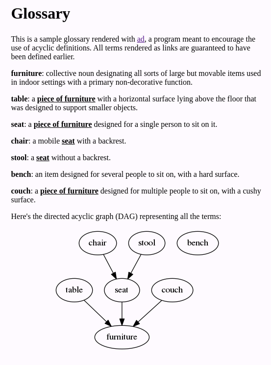

Constructive Dictionaries
==

This project is a proof-of-concept command-line tool for building and
presenting dictionaries as a strict hierarchy of terms.

The goal is to produce precise technical and philosophical dictionaries and
glossaries without circular definitions. The solution is to highlight
and link technical terms, and prevent references to terms that have not
yet been defined.

Here's an example of a glossary rendered with `vanity` into an HTML page:


The source for this glossary is:

```yaml
# A sample glossary.
---
- term: furniture
  def: >
    collective noun designating all sorts of large but movable items used in
    indoor settings with a primary non-decorative function.
  syn:
    - piece of furniture
- term: table
  def: >
    a [piece of furniture] with a horizontal surface lying above the floor
    that was designed to support smaller objects.
  syn:
    - tables
- term: seat
  def: >
    a [piece of furniture] designed for a single person to sit on it.
  syn:
    - seats
- term: chair
  def: >
    a mobile [seat] with a backrest.
  syn:
    - chairs
- term: stool
  def: >
    a [seat] without a backrest.
  syn:
    - stools
- term: bench
  def: >
    an item designed for several people to sit on, with a hard surface.
  syn:
    - benches
- term: couch
  def: >
    a [piece of furniture] designed for multiple people to sit on, with
    a cushy surface.
  syn:
    - couches
```

Implementation
--

This proof-of-concept is implemented as a command-line program that
reads a dictionary in source form, checks its validity, and produces a
readable document.

The input is a list of term definitions. The YAML syntax was chosen as
it accommodates text better than JSON and is more readable than
XML. Structured data such as lists of synonyms can easily be added
without extending the syntax. The only originality is in the markup
language used in the body of the definitions, which uses its own
conventions to link terms to their definition.

The Go language was chosen for this implementation as it's relatively
friendly to external contributors, and it was a good opportunity for
the author to learn it.

Installation
--

Check out the prerequisites in [DEV.md](DEV.md), then build and install with
`make && make install`.

TODO: distribute binaries.

Documentation
--

Once installed, check out the output of `vanity --help`.
The following output formats are supported:

* HTML snippet or standalone page
* graph in the dot format understood by Graphviz

TODO: document the input format

Suggested features
--

Public awareness:
* Write an introductory article explaining why and when this thing can
  be useful.
* Use the tool and publish reports on its usefulness and lessons
  learned.

Maintenance and distribution:
* Compile and distribute binaries for the most popular platforms. Note
  that Go makes this easy by producing static binaries and
  cross-compiling.
* Add automatic testing using one of Travis, CircleCI, Github Actions,
  etc.
* Add contribution guidelines (highly recommended to do before
  accepting contributions).

User-facing features:
* Document the input format.
* Produce a graph even if it has cycles, as an aid to see what's going
  on.
* Use topological sorting to implement some of the following features:
  - Rearrange the input document in an order compatible with the
    dependencies. This is a conversion from yaml to yaml.
  - Automatically sort the input document topologically so that the
    author doesn't have to. This is only for checking purposes.
    This doesn't produce new input or different output.
  - Sort the definitions in the output document in dependency order
    or reverse dependency order, depending on user preference.
* Add an option to sort the terms alphabetically.
* Add support for multiple senses via some dedicated syntax. It could
  be something like `something_2` where the term is identified by the
  full string `something_2` but rendered as just `something` or
  `something (2)`, and links to the correct definition.
* Offer out-of-the-box option for showing definition preview on hover
  or single-tap on mobile. This would work like the Wikipedia mobile
  app or [Wikiwand](https://www.wikiwand.com/en/Hippopotamus).
* Export to PDF or whichever format is in
  demand. [Pandoc](https://pandoc.org/) is an excellent tool for
  this. Part of the work would consist in making the original output
  of vanity fully understood by pandoc. Perhaps the best format for
  this isn't HTML but some other language best suited for pandoc input.
